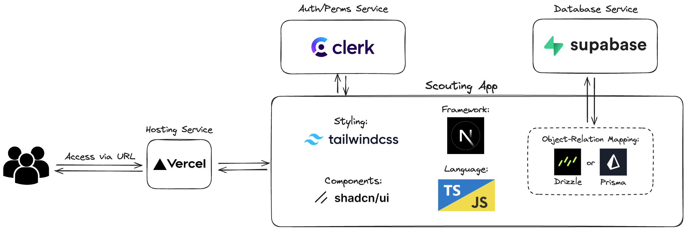

# RHR Event Scouting Application [WIP]

This is a Next.js project bootstrapped with [`create-next-app`](https://nextjs.org/docs/app/api-reference/cli/create-next-app) to be used for scouters to log scouting data at competitions.

sample change to test PR

### Technical Stack Details

This app uses the following technologies:

- [Next.js](https://nextjs.org/docs) (React meta-framework)
- Typescript
- [TailwindCSS](https://tailwindcss.com/docs/installation) (Styling alternative)
- [Shadcn/ui](https://ui.shadcn.com/docs) (Headless component library)
- Supabase (Postgres database service)
- [Prisma](https://www.prisma.io/docs) (ORM library to communicate to the database)
- [Clerk](https://clerk.com/docs) (Authentication service)
- ngrok (Localhost tunneling service)
- Vercel (Deployment platform)

### Diagram

## System Dependencies

- Node.js
- IDE of choice that supports web development (ex: VS Code)

### Useful VS Code extensions

- GitLens
- ESLint
- Code Spell Checker
- npm Intellisense
- Path Intellisense
- Auto Import
- Pretty TypeScript Errors
- Prisma
- Tailwind CSS Intellisense

## Getting Started

_NOTE:_ Please make sure your `.env` file is setup with the correct values. You can work with Julian or the other developers to do so. To practice good coding standards, we will NOT be including this environment file in the git repository.

1. Install project dependencies:

`npm install`

2. Run the development server:

`npm run dev`

You can now access [http://localhost:4000](http://localhost:4000) with your browser to see the web page.

### Setting up `ngrok` to test Clerk webhooks

Since we will be using Clerk to fire webhooks to our application to update our database with user info and our localhost environments are not exposed to the internet, we need to use `ngrok`. `ngrok` is a service that hosts a static domain for other services to talk with our local servers.

To set up `ngrok` follow these steps:

1. Download and install [`ngrok`](https://ngrok.com/download)
2. Run the command `ngrok config add-authtoken <token>` (ask Julian for the `ngrok` token)
3. Run `npm run ngrok:setup` to connect `ngrok` to your localhost server

#### NOTE

This method will only allow for ONE developer at a time to test clerk endpoints. We need to investigate other ways to spin up multiple, short-lived endpoints to allow more developers to work on Clerk webhooks at a time (if needed).
